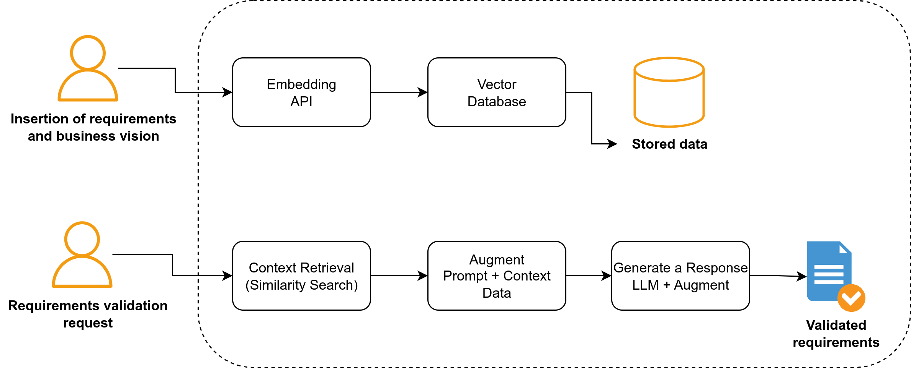

# ReqCheck

This project is an automatic software requirements validation engine, developed in Django, that uses:

🔹 Embeddings to calculate similarity between requirements.

🔹 Business insights extracted from documents (PDFs).

🔹 Language Models (LLMs) for semantic analysis.

🔹 RAG (Retrieval Augmented Generation) to enrich validation by combining relevant project context with the language model.

The engine evaluates requirements in terms of:

✅ Consistency

✅ Completeness

✅ Ambiguity

This repository aims to perform tests on software requirements to support quality improvement during requirements engineering.

⚠️ Status: This project is still in development and subject to change.

Flow Overview:

